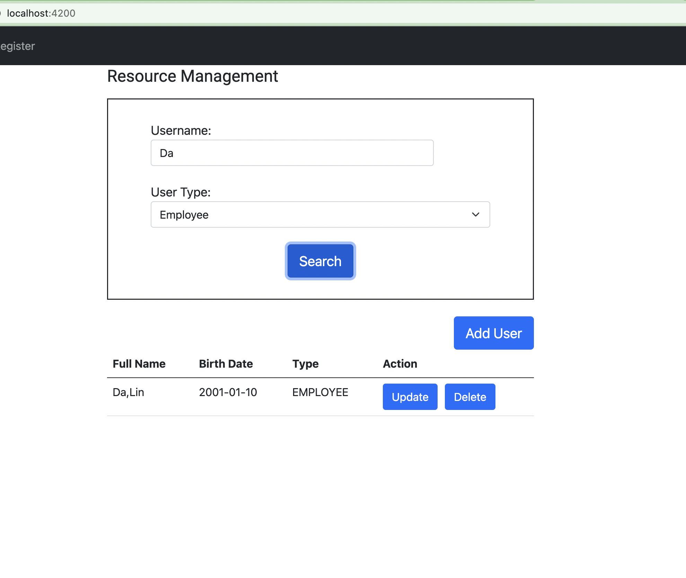
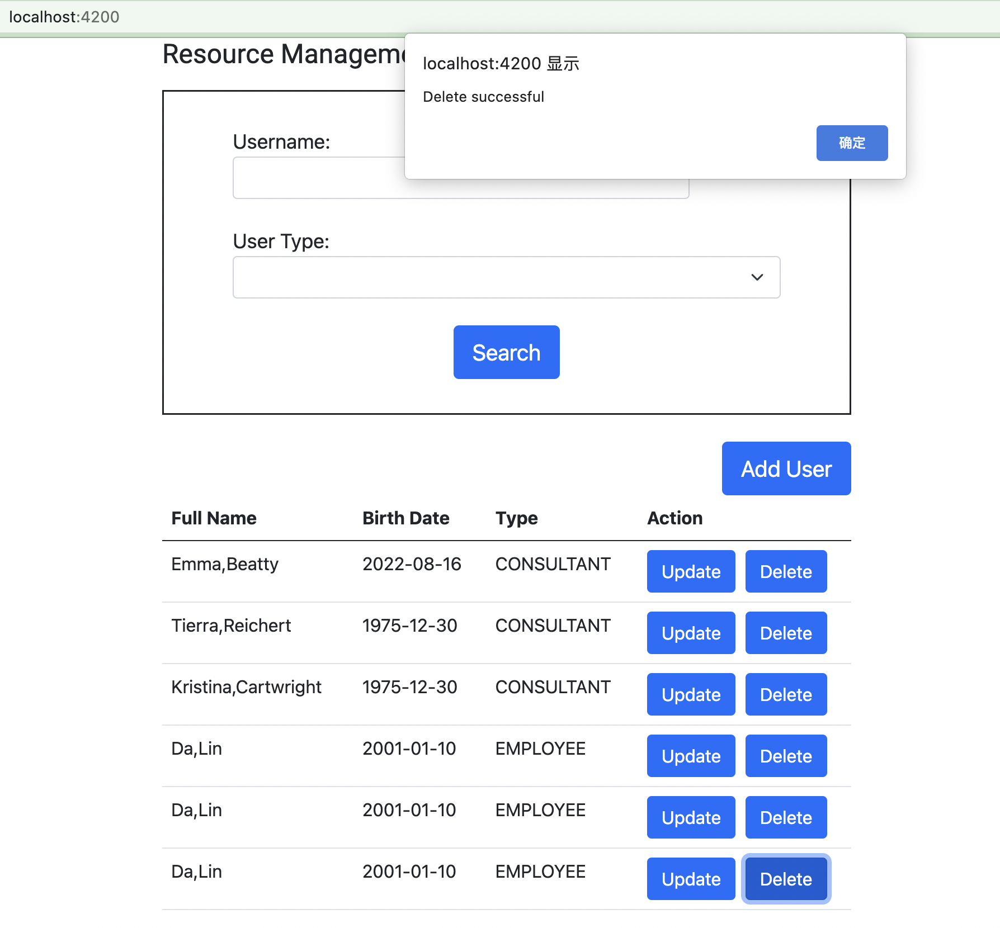
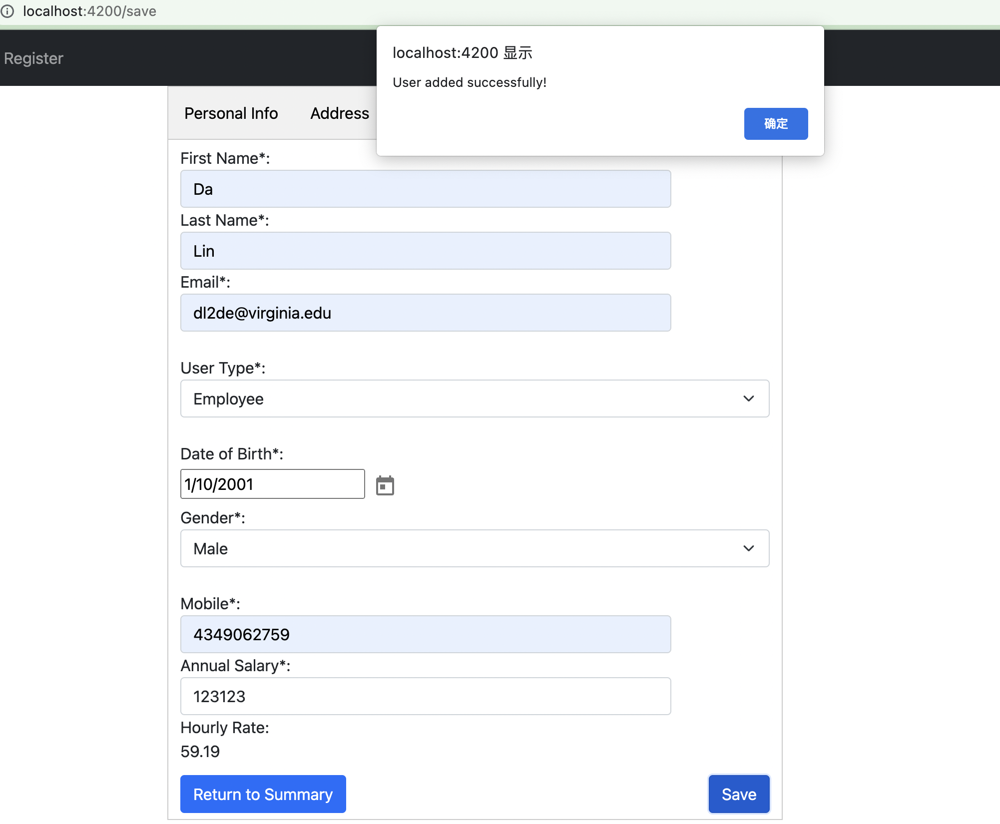
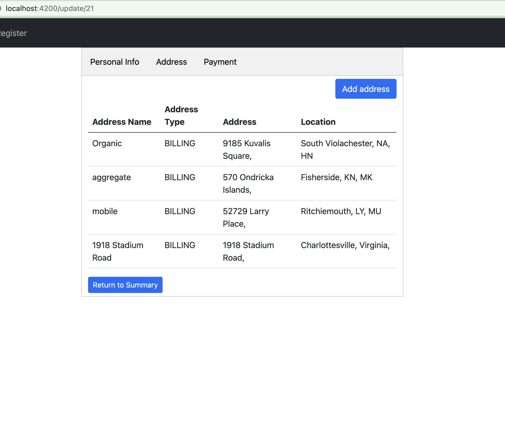
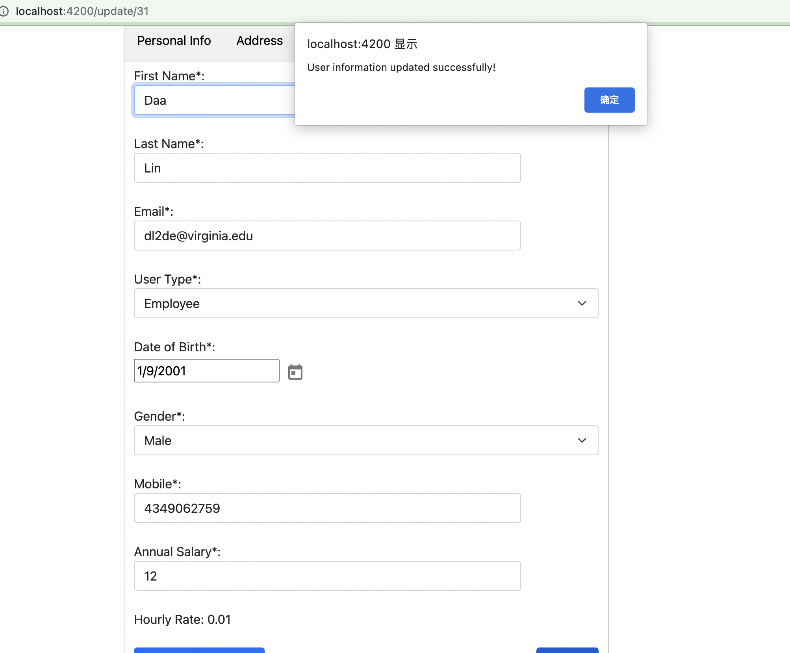
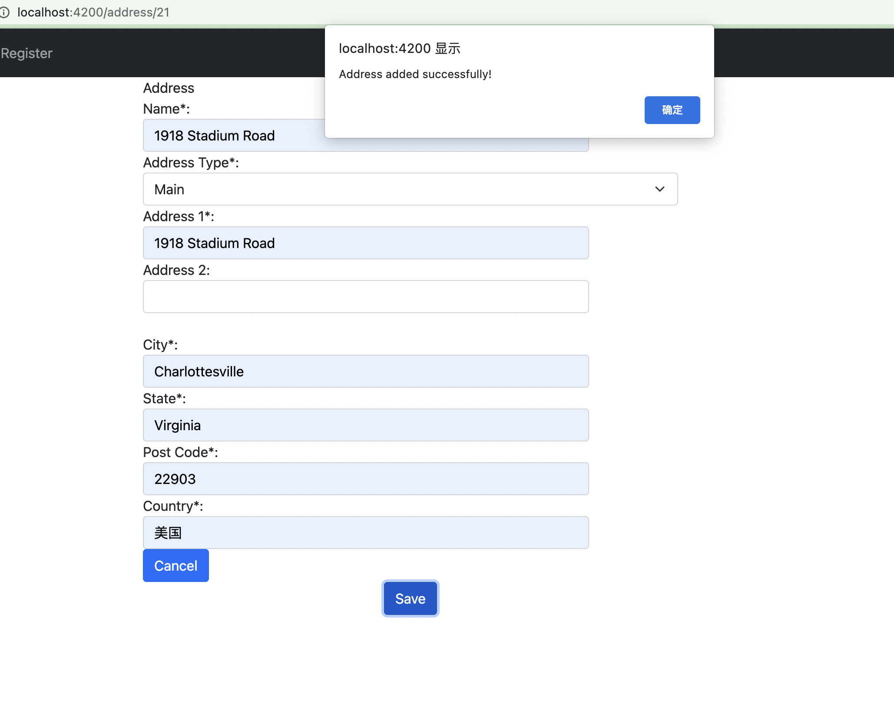

# Getting started

This is a front-end project for a HR system using Angular as framework. Run ng serve for a dev server. Navigate to http://localhost:4200/. The app will automatically reload if you change any of the source files.

## Functionality overview

The example application is a Human Resource Management site . It uses a API address http://35.173.125.189:8080 for all requests, including GET, POST DELETE and PUT.

**General functionality:**

- View list of user summary in organization
- Ability to filter user summaries by name and/or employee type (Single service which can take optional parameters of name, employeeType)
- Ability to create, update, delete users
- Ability to get addresses for user
- Ability to add multiple addresses for a user (Addresses follow standard US format)
- Ability to send error message when user miss required fields and validation message when user action is successful

**The general page breakdown looks like this:**

- Home page (URL: / )
    - Search box to filter user summaries by name and/or employee type
    - Table of user summaries
    
    
- Save page (URL: /save )
    - Fields to imput user information
    - Ability to store the data into database
    
- Update page (URL: /update/:id )
    - Fields with values already in the database
    - Ability for users to change values and update user information data
    - Ability to view the addresses for the user
    - id in URL represents the unique userID
    
    
- Add Address page (URL: 'address/:id' )
    - Ability for users to input address data and upload it
    - id in URL represents the unique userID, the address will only be added under this userID
    

## Improvements to the System

- There is a functional problem. When adding a new user to the database, we cannot add address at the same time. The addresses can only be added in the update page. This is due to the fact that address requires the information of the unique userID, which means it can only be added after the user is created. However, the tabs didn't restrict the users to input the addresses before user object is created. Due to time constriant of 24 hours, I did not manage to accomplish that requirement. I believe that can be improved in the future by restricting user access to input address data. Only after creating the user, can addresses be added to the newly created userID which can be included in the URL.
- When deleting the user data, the addresses corresponding to this user are not deleted, which can be improved.
- UI can be improved. Again, due to time constraint, it requires a lot of refinement to make the UI look prettier. 
